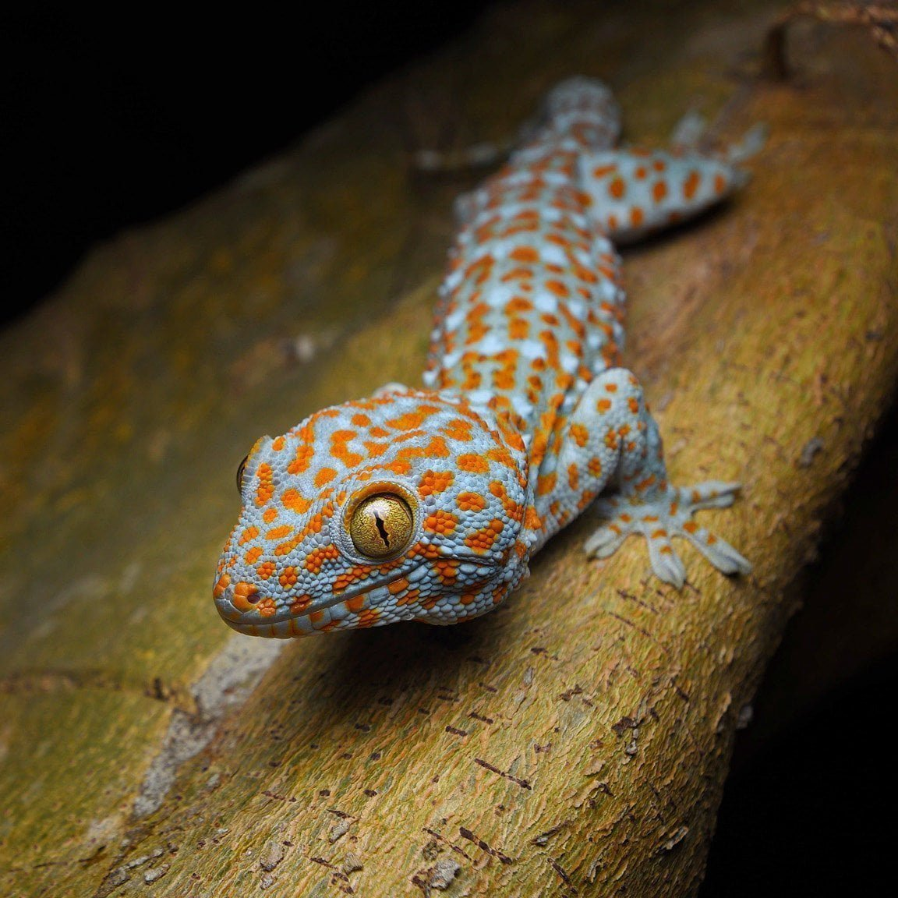

# Gecko Tokay : portrait d’un gecko

Le **Gecko Tokay** (*Gekko gecko*) est l’un des geckos les plus reconnaissables au monde. Originaire principalement d’Asie du Sud-Est, il se distingue par sa grande taille, sa coloration bleu-gris ponctuée de taches orangées et son comportement particulièrement affirmé.

Contrairement à certains petits geckos souvent discrets, le Tokay possède une présence impressionnante. C’est un animal essentiellement nocturne, capable de grimper sur des surfaces presque verticales grâce aux structures microscopiques présentes sous ses doigts.

## Caractéristiques principales

* Taille adulte pouvant atteindre environ **30 à 35 cm**.
* Activité principalement **nocturne**.
* Coloration généralement bleu-gris avec des taches rouges ou orange.
* Excellentes capacités d’escalade.
* Vocalisations puissantes et facilement reconnaissables.
* Tempérament territorial et parfois défensif.

## Habitat naturel

Dans la nature, le Gecko Tokay vit dans les régions tropicales chaudes et humides. On peut notamment le rencontrer dans les forêts, sur les arbres, dans les zones rocheuses et parfois à proximité des habitations humaines.

Son corps est particulièrement bien adapté à la vie en hauteur. Ses doigts lui permettent de s'accrocher à de nombreuses surfaces, tandis que ses grands yeux sont adaptés aux faibles niveaux de lumière rencontrés pendant la nuit.



## Comportement

Le Gecko Tokay est connu pour être plus territorial que de nombreuses autres espèces de geckos. Lorsqu’il se sent menacé, il peut ouvrir la bouche, vocaliser et tenter de mordre.

Il ne faut donc pas considérer cette espèce comme un animal particulièrement adapté aux manipulations fréquentes. Son intérêt réside davantage dans l’observation de ses comportements naturels, de ses déplacements et de ses techniques de chasse.

## Alimentation

Le Tokay est principalement insectivore. Dans son environnement naturel, il chasse différentes petites proies, notamment des insectes et d’autres invertébrés.

Sa méthode de chasse repose beaucoup sur l’attente et sur des déplacements rapides lorsqu’une proie se présente à proximité.

## Une espèce remarquable à observer

Le Gecko Tokay attire particulièrement l’attention par son apparence, mais également par son comportement et ses capacités physiques. Sa façon de grimper, ses vocalisations et son caractère territorial en font une espèce très différente des geckos généralement considérés comme calmes et faciles à manipuler.

Pour découvrir davantage d’informations sur l’espèce, consultez la page consacrée au [Gecko Tokay](https://fr.wikipedia.org/wiki/Gekko_gecko).

## Fiche numérique de l’espèce

Dans une application consacrée aux reptiles, les principales informations sur le Gecko Tokay pourraient être représentées en **C++** sous la forme d’une structure :

```cpp
#include <iostream>
#include <string>

struct Gecko {
    std::string nom;
    std::string nomScientifique;
    double tailleMax;
    bool nocturne;
};

int main() {
    Gecko tokay{
        "Gecko Tokay",
        "Gekko gecko",
        35.0,
        true
    };

    std::cout << tokay.nom << '\n';
    std::cout << "Nom scientifique : " << tokay.nomScientifique << '\n';
    std::cout << "Taille maximale : " << tokay.tailleMax << " cm\n";

    return 0;
}
```

Cet exemple montre comment les caractéristiques principales d’une espèce peuvent être stockées et exploitées dans un programme, par exemple pour créer une **base de données numérique d’animaux** ou une application éducative.

## Conclusion

Avec sa coloration spectaculaire, sa taille importante et son comportement territorial, le **Gecko Tokay** est un reptile particulièrement intéressant. Il représente un excellent exemple des adaptations développées par les geckos pour vivre et chasser dans des environnements tropicaux.

Son observation permet notamment de découvrir comment certaines espèces nocturnes utilisent leur vision, leurs capacités d’escalade et leur comportement territorial pour survivre dans leur milieu naturel.
